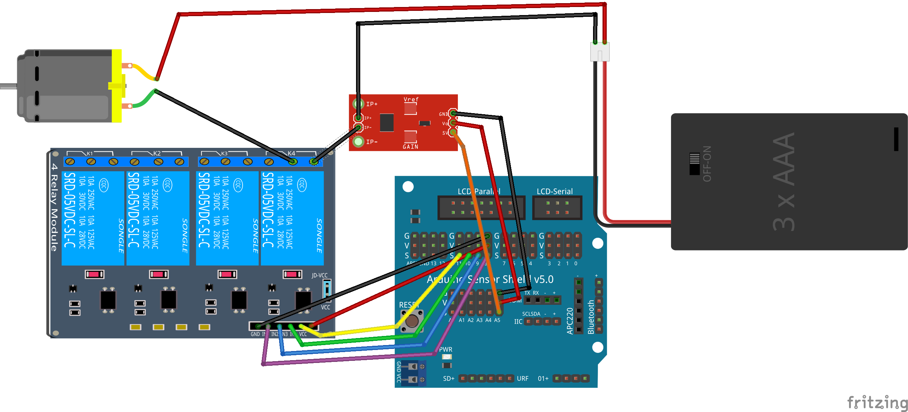

# SmartCities_Eficiencia

##  Eficiencia Energética

Implementaremos una regleta eficiente que nos permitirá conocer el consumo de los dispositivos conectados y su control desde fuera.
  * Mide y muestra el consumo eléctrico
  * Podemos activar desactivar los distintos contactos
  * Posibilidad de programación de horas de encendido y apagado de los dispositivos

Toda la información así como el control está disponible desde Internet posibilitando la elección del momento donde el coste del consumo sea menor.

## Maqueta: Regleta eficiente
* Mide y muestra el consumo
* Muestra el consumo acumulado

#### Materiales
* LCD
* Sensor de corriente
* Reles para control remoto

### Control remoto de reles

Podemos utilizar relés para controlar cualquier dispositivo eléctrico

Ejemplo: SmartCities/Eficiencia/Control_remoto

### Medida de consumos

Utilizando el sensor ACS712 medidos la intensidad y por tanto el consumo de los dispositivos conectados a un relé

Ejemplo: SmartCities/Eficiencia/Medida_consumo
